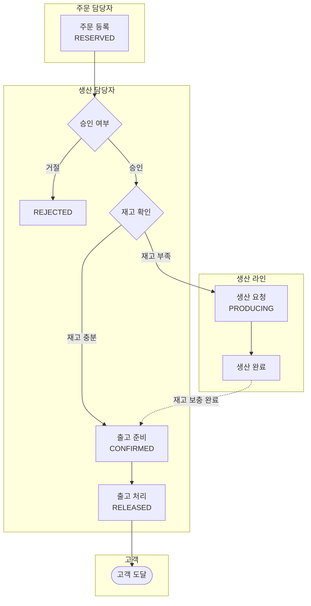

# 반도체 시료 생산 주문 관리 시스템

## 배경

가상의 반도체 회사 "S-Semi"가 있습니다.  
이 회사는 다양한 종류의 반도체 시료(Sample)를 생산하여 연구소, 팹리스(Fabless) 업체, 대학 연구실 등의 고객에게 납품하고 있습니다.  
시료는 주문이 들어오면 웨이퍼 공정 설비를 통해 제작되고, 검수를 거쳐 고객에게 출고됩니다.

그런데 최근 들어 주문량이 급증하면서 문제가 생겼습니다.

> "어, 이 주문 처리됐나요?"  
> "공정 예약을 했는데, 언제 완성되는지 모르겠어요."  
> "이미 충분한 시료 재고가 있는데, 왜 추가 공정이 돌아가고 있나요?"

엑셀과 메모장으로 주문을 관리하다 보니 실수가 잦고, 재고와 공정 현황을 한눈에 파악하기 어려웠습니다.  
이러한 이유로 S-Semi에서는 더 체계적인 시료 관리를 위한 **반도체 시료 생산 주문 관리 시스템**을 개발하기로 결정했습니다.

---

## 역할

| 역할 | 설명 |
|------|------|
| 고객 | 시료 요청자 |
| 주문 담당자 | 주문서 관리 |
| 생산 담당자 | 시료 생산, 승인 |

### 역할별 흐름도

```
(고객) → [시료 요청] → (주문 담당자) → [주문서 전달] → (생산 담당자)
(생산 담당자) → [승인 / 거절]
```

---

## 시스템 개요

- 콘솔 기반으로 동작

### 생산 라인

- 한 장에서 시료 하나를 생산하는 설비 흐름
- 하나의 생산 라인은 시료를 하나씩 생산
- 주문이 들어온 시료에 대해서만 생산

### 전체 흐름도



---

## 주문 상태 흐름

모든 주문은 아래의 상태를 보유합니다.  
`REJECTED`는 거절된 주문으로 정상 흐름 외의 상태이며 모니터링에서 제외됩니다.

| 상태 | 의미 |
|------|------|
| `RESERVED` | 주문 접수 |
| `REJECTED` | 주문 거절 |
| `PRODUCING` | 주문 승인 완료 및 재고 부족으로 생산 중 |
| `CONFIRMED` | 주문 승인 완료 및 출고 대기 중 |
| `RELEASE` | 출고 완료 |

---

## 기능 명세

### 메인 메뉴

기능별 선택 화면을 Display하며, 전체 시료에 대한 요약 정보를 확인합니다.

| 메뉴 | 설명                               |
|------|----------------------------------|
| 시료 관리 | 새로운 시료 등록, 목록 조회, 속성별 검색 (ID · 이름 · 평균 생산시간 · 수율) |
| 주문 접수 | 고객 주문 접수                         |
| 주문 승인/거절 | 고객 주문 접수에 대해 생산 라인 담당자의 승인·거절 처리 |
| 모니터링 | 상태별 주문 수 및 시료별 재고 현황 확인          |
| 출고 처리 | `CONFIRMED` 상태 주문에 대해 출고 실행      |
| 생산 라인 | 현재 생산 중인 시료 및 대기 중인 생산 큐 확인      |

---

### 시료 관리

시료(Sample)는 이 시스템의 가장 기본이 되는 단위입니다.  
각 시료는 고유한 이름과 속성을 가지며, 시스템에 등록된 시료만 주문 가능합니다.

#### 시료 속성

| 속성 | 설명 |
|------|------|
| 시료 ID | 고유 식별자 |
| 시료 이름 | 시료명 |
| 평균 생산 시간 | 시료 1개 생산에 걸리는 평균 시간 |
| 수율 | 정상 시료 수 / 총 생산 시료 수 (예: 100개 중 90개 정상 → 0.9) |

#### 메뉴 내용

- **시료 등록**: 새로운 시료를 시스템에 추가 (속성값: 시료 ID, 이름, 평균 생산 시간, 수율)
- **시료 조회**: 등록된 모든 시료 목록 확인. 현재 재고 수량도 함께 표시
- **시료 검색**: 검색 기준 속성(ID · 이름 · 평균 생산시간 · 수율)을 먼저 선택한 뒤 검색어를 입력하여 시료를 검색. `SampleRepository.search(key, value)`의 `key`에 선택한 속성명을 전달하여 부분 일치(대소문자 무시) 검색 수행

---

### 주문 접수

고객이 시료를 요청하면 주문 담당자가 주문을 생성합니다.  
주문은 고객이 요청한 시료 예약을 관리하는 단위입니다.

#### 주문 속성

| 속성 | 설명 |
|------|------|
| 시료 ID | 주문할 시료의 ID |
| 고객명 | 주문 고객 이름 |
| 주문 수량 | 요청 수량 |
| 상태 | 현재 주문 상태 |

#### 주문 내용

- 주문 단위로 접수 관리
- 주문시 입력값: 시료 ID, 고객명, 주문 수
- 이 시점의 주문 상태: `RESERVED`

---

### 주문 승인 / 거절

접수된 주문(`RESERVED`) 목록을 확인하고, 특정 주문에 대해 승인 또는 거절합니다.

#### 접수된 주문 목록

- `RESERVED` 상태의 주문 목록 표시
- 메뉴 진입 시 항상 상단에 접수된 주문 목록이 표시되어야 함

#### 주문 승인

접수된 특정 주문에 대해 승인합니다. 승인 시 재고 상황에 따라 2가지 방식으로 자동 처리됩니다.

| 상황 | 처리 방식 |
|------|-----------|
| 재고 충분 | 주문을 즉시 `CONFIRMED` 상태로 전환 |
| 재고 부족 | 생산 라인에 자동 등록, 주문 상태를 `PRODUCING`으로 전환 |

재고 부족 시 출력 메시지:
```
재고 부족 : 부족분 {N} ea 승인하시겠습니까? (실 생산량 {M} ea / {X} min)
```
- `M`: 수율을 고려하여 실제 생산해야 할 수량
- `X`: 평균 생산 시간을 고려한 총 소요 시간

#### 주문 거절

- 접수된 특정 주문에 대해 거절
- 즉시 `REJECTED` 상태로 전환

---

### 모니터링

담당자가 현재 시스템 상태를 한눈에 파악할 수 있도록 구성합니다.

#### 주문량 확인

- 현재 상태별(`RESERVED` / `CONFIRMED` / `PRODUCING` / `RELEASE`) 목록 확인
- 상태별 총 건수 표기 후 하단에 목록 표기
- `REJECTED`는 유효한 주문이 아니므로 제외

#### 재고량 확인

각 시료별 현재 재고 수량 확인. 주문 대비 재고 수량에 따라 상태 표기:

| 상태 | 조건 |
|------|------|
| 여유 | 주문 대비 재고 충분 |
| 부족 | 주문 대비 재고 수량 부족 |
| 고갈 | 수량이 0인 상태 |

---

### 생산 라인

주문량에 대한 부족분을 생산하되, 수율 및 오차를 고려하여 시료를 생산합니다.

#### 생산량 계산

- **실 생산량**: `ceil(부족분 / (수율 × 0.9))`
- **총 생산 시간**: `평균 생산 시간 × 실 생산량`
- 생산 완료 시 주문 상태: `PRODUCING` → `CONFIRMED`

#### 메뉴 내용

- **생산 현황**: 현재 생산 중인 시료 정보 표기 (주문 정보, 현재까지의 생산량 등)
- **대기 주문 확인**: 생산 큐의 대기 목록 출력 (스케줄링 전략: FIFO)

---

### 출고 처리

- 재고가 충분해진 `CONFIRMED` 주문에 대해 출고를 처리
- 특정 주문에 대해 출고 실행 → 주문 상태가 `RELEASE`로 전환

---

## 아키텍처: MVC 패턴

참조 스켈레톤: [ConsoleMVC-gujun.jeong-14004536](https://github.com/stormv2222/ConsoleMVC-gujun.jeong-14004536)

### 폴더 구조

```
semicon/
├── main.py                        # 진입점 — 의존성 조립 후 run() 호출만 담당
├── models/
│   ├── __init__.py
│   ├── sample.py                  # Sample dataclass + SampleRepository
│   ├── order.py                   # Order dataclass + OrderRepository
│   ├── inventory.py               # Inventory (시료별 재고 관리)
│   └── production_queue.py        # ProductionQueue (FIFO 생산 큐)
├── views/
│   ├── __init__.py
│   ├── sample_view.py             # 시료 관련 입출력
│   ├── order_view.py              # 주문 관련 입출력
│   ├── monitoring_view.py         # 모니터링 출력
│   ├── production_view.py         # 생산 라인 출력
│   └── release_view.py            # 출고 처리 입출력
└── controllers/
    ├── __init__.py
    ├── sample_controller.py       # 시료 관리 흐름 조율
    ├── order_controller.py        # 주문 접수/승인/거절 흐름 조율
    ├── monitoring_controller.py   # 모니터링 조회 조율
    ├── production_controller.py   # 생산 라인 조율
    ├── release_controller.py      # 출고 처리 조율
    └── main_controller.py         # 메인 메뉴 루프 및 각 Controller 진입
```

### 레이어 역할

| 레이어 | 역할 | 제약 |
|--------|------|------|
| **Model** | 엔티티(dataclass) + 인메모리 저장소(Repository). 비즈니스 상태와 데이터 관리 | View·Controller를 import하지 않음 |
| **View** | 콘솔 출력(`print`) 및 입력(`input`) 전담. 포맷팅만 수행 | 비즈니스 로직 없음. Model의 dataclass만 참조 가능 |
| **Controller** | View에서 입력 수집 → Model 조작 → View로 결과 출력하는 흐름 조율 | 직접 `print`/`input` 호출 금지 |

### 의존 방향

```
main.py
  └─ 생성 및 주입 (Composition Root)
       ├─ Repository들  (models/)
       ├─ View들        (views/)       ← Repository 의존 없음
       └─ Controller들  (controllers/)
            ├─ _repo: XxxRepository
            └─ _view: XxxView
```

- Model ↔ View 간 직접 의존 없음
- Controller만 Model과 View를 모두 참조

### 구현 컨벤션

**진입점 `main.py`**
```python
from models.sample import SampleRepository
from views.sample_view import SampleView
from controllers.main_controller import MainController
# ...

if __name__ == "__main__":
    # 저장소 생성
    sample_repo = SampleRepository()
    order_repo = OrderRepository()
    # ...

    # 뷰 생성
    sample_view = SampleView()
    # ...

    # 컨트롤러 생성 및 주입
    main_ctrl = MainController(...)
    main_ctrl.run()
```

**메뉴 디스패치**: `if/elif` 대신 dict 기반 커맨드 매핑 사용
```python
menu = {
    "1": ("시료 관리", self._sample_controller.run),
    "2": ("주문 접수", self._order_controller.run_reserve),
    # ...
    "0": ("종료", None),
}
```

**의존성 주입**: 생성자 주입(Constructor Injection) 방식
```python
class OrderController:
    def __init__(self, order_repo: OrderRepository, inventory: Inventory,
                 production_queue: ProductionQueue, order_view: OrderView):
        self._order_repo = order_repo
        self._inventory = inventory
        self._production_queue = production_queue
        self._view = order_view
```

**타입 힌트**: 모든 메서드에 파라미터·반환 타입 힌트 적용 필수

**테스트 격리**: mock 라이브러리 대신 `view.get_input`을 람다로 교체하는 방식으로 stdin 주입
```python
def _set_inputs(view, *values):
    it = iter(values)
    view.get_input = lambda prompt: next(it)
```

---

## 데이터 영속성

참조 구현: [DataPersistence-gujun.jeong-14004536](https://github.com/stormv2222/DataPersistence-gujun.jeong-14004536)

### 저장 방식

- **JSON 파일** 기반 영속성 사용
- 표준 라이브러리 `json` 모듈을 사용하지 않고, 참조 레포의 **`json_lib`** (자체 구현 JSON 라이브러리)를 그대로 가져와 사용
- `json_lib/`는 완성된 코드로 **수정 금지**. 공개 API인 `load()`와 `dump()`만 사용

```python
from json_lib import load, dump

data = load("sample.json")          # JSON 파일 → Python dict/list
dump(data, "sample.json", indent=2) # Python dict/list → JSON 파일 (utf-8)
```

### 저장 파일 구조

모든 데이터 파일은 아래 공통 구조를 따른다:

```json
{
  "next_id": 3,
  "records": [
    {"id": 1, "name": "A형 시료", "avg_time": "30", "yield_rate": "0.9"},
    {"id": 2, "name": "B형 시료", "avg_time": "45", "yield_rate": "0.85"}
  ]
}
```

- `next_id`: 다음 레코드에 부여할 ID (삭제 후에도 재사용하지 않음)
- `records`: 레코드 배열. 각 레코드는 `id` 포함 dict
- 모든 값은 **문자열**로 저장 (숫자도 `"30"` 형태)
- 인코딩: `utf-8`, 들여쓰기: `indent=2`

### 파일명 규칙

| 데이터 | 파일명 |
|--------|--------|
| 시료 | `data/sample.json` |
| 주문 | `data/order.json` |
| 재고 | `data/inventory.json` |

### Repository 설계

MVC의 Model 레이어 내 각 Repository 클래스에 적용한다.

**핵심 원칙 — 무상태(Stateless) 설계**:
Repository 인스턴스는 데이터를 메모리에 캐시하지 않는다. 매 연산마다 파일을 읽고, 쓰기 연산은 즉시 파일에 반영한다.

**공통 메서드 시그니처**:

```python
class SampleRepository:
    def __init__(self, file_path: str) -> None: ...

    # 내부 헬퍼
    def _load_raw(self) -> dict: ...          # {"next_id": N, "records": [...]}
    def _load(self) -> list[dict]: ...        # records 리스트만 반환
    def _save(self, raw: dict) -> None: ...   # 전체 dict를 파일에 저장

    # 공개 CRUD
    def create(self, fields: dict) -> dict: ...               # 생성된 레코드 반환
    def read_all(self) -> list[dict]: ...                     # 전체 레코드 반환
    def read_one(self, record_id: int) -> dict | None: ...    # 단건 조회, 없으면 None
    def update(self, record_id: int, fields: dict) -> dict | None: ...  # 수정 또는 None
    def delete(self, record_id: int) -> bool: ...             # 삭제 성공 여부
    def search(self, key: str, value: str) -> list[dict]: ... # 문자열 일치 검색
```

**파일 없음 처리**: `_load_raw()` 호출 시 파일이 없으면 예외 없이 `{"next_id": 1, "records": []}` 반환

**파일 형식 오류 처리**: 파일이 존재하나 `records` 키가 없거나 배열이 아닌 경우 `ValueError` 발생

**존재하지 않는 ID**: 조회/수정은 `None`, 삭제는 `False` 반환 (예외 없음)

### 파일 I/O 시점

| 메서드 | 파일 읽기 | 파일 쓰기 |
|--------|-----------|-----------|
| `create` | O | O (즉시 저장) |
| `read_all` | O | X |
| `read_one` | O | X |
| `update` | O | O (즉시 저장) |
| `delete` | O | O (즉시 저장) |
| `search` | O | X |

### 테스트 격리

Repository 테스트는 `tempfile`로 임시 파일을 생성해 실제 파일 I/O를 검증한다. 파일 mock 사용 금지.

```python
import tempfile, os

class TestSampleRepository(unittest.TestCase):
    def setUp(self):
        tmp = tempfile.NamedTemporaryFile(delete=False, suffix=".json")
        self.file_path = tmp.name
        tmp.close()
        os.unlink(self.file_path)   # 파일 없는 상태로 시작
        self.repo = SampleRepository(self.file_path)

    def tearDown(self):
        if os.path.exists(self.file_path):
            os.unlink(self.file_path)
```

영속성 검증 시에는 동일 경로로 새 Repository 인스턴스를 생성해 실제 파일을 재로드하여 확인한다.

---

## 모니터링 / 실시간 조회

참조 구현: [DataMonitor-gujun.jeong-14004536](https://github.com/stormv2222/DataMonitor-gujun.jeong-14004536)

### 핵심 원칙

- 데이터 파일 변경 시 **1초 이내에 자동으로 화면에 반영**
- 외부 라이브러리(`watchdog`, `rich`, `curses`) 없이 표준 라이브러리만 사용
- Repository의 무상태(stateless) 설계 덕분에 `read_all()` 호출만으로 항상 최신 데이터 획득

### FileWatcher — 파일 변경 감지

`app/watcher.py`에 `FileWatcher` 클래스를 구현한다. `os.path.getmtime()`으로 1초마다 파일 수정 시각을 폴링하여 변경을 감지하면 등록된 콜백을 호출한다.

```python
class FileWatcher:
    def __init__(self, file_path: str, callback: Callable, interval: float = 1.0) -> None: ...
    def start(self) -> None   # 백그라운드 데몬 스레드 시작
    def stop(self) -> None    # stop_event set → thread.join(timeout=2.0)
    def _run(self) -> None    # 폴링 루프
    def _get_mtime(self) -> Optional[float]
```

**폴링 루프 구현**:

```python
def _run(self) -> None:
    while not self._stop_event.wait(self._interval):  # 1초 대기, stop 시 즉시 종료
        mtime = self._get_mtime()
        if mtime != self._last_mtime:
            self._last_mtime = mtime
            self._callback()
```

- `threading.Event.wait(interval)` 사용 — busy-wait 없음, stop 시 즉시 반응
- 스레드는 `daemon=True` — 메인 프로세스 종료 시 자동 소멸
- 파일이 없어도 예외 없이 동작 (`_get_mtime()` → `None` 반환)
- 파일이 새로 생성되면 `None → float` 변화로 감지하여 콜백 호출

### MonitorController — 갱신 흐름 조율

```python
class MonitorController:
    def __init__(self, repository: RecordRepository,
                 view: MonitorView, watcher: FileWatcher) -> None:
        self._repo = repository
        self._view = view
        self._watcher = watcher
        self._watcher._callback = self._on_file_changed  # 콜백 연결

    def _on_file_changed(self) -> None:
        if not self._refresh_active:   # 사용자 입력 중에는 갱신 억제
            self._do_refresh()

    def _do_refresh(self) -> None:
        records = self._repo.read_all()
        self._view.show_dashboard(records)

    def run(self) -> None:
        self._watcher.start()
        try:
            self._do_refresh()         # 초기 화면 출력
            # 메뉴 루프 ...
        finally:
            self._watcher.stop()
```

### 데이터 변경 → 화면 반영 흐름

**자동 갱신 (파일이 외부에서 수정된 경우)**

```
JSON 파일 수정
  └─ FileWatcher._run() 폴링 (1초)
       └─ getmtime() 변화 감지
            └─ callback() → MonitorController._on_file_changed()
                 └─ _do_refresh()
                      ├─ repo.read_all()   ← 파일 전량 재읽기 (캐시 없음)
                      └─ view.show_dashboard()
                           └─ _clear() + 전체 재출력
```

**수동 조회 (사용자 메뉴 선택)**

```
사용자 입력
  └─ MonitorController.search_records() 등
       └─ repo.read_all() 또는 repo.search(key, value)
            └─ view.show_dashboard() / view.show_record()
```

### 사용자 입력 중 갱신 억제

CRUD 또는 검색 입력처럼 다중 줄 입력이 필요한 동안 FileWatcher 콜백이 화면을 덮어쓰지 못하도록 `_refresh_active` 플래그로 차단한다. `try/finally`로 예외 발생 시에도 반드시 플래그를 해제한다.

```python
def create_record(self) -> None:
    self._refresh_active = True
    try:
        # view.get_input() 으로 여러 필드 입력 수집
        ...
    finally:
        self._refresh_active = False
```

### MonitorView — 대시보드 출력

```python
class MonitorView:
    def show_dashboard(self, records: list[Record]) -> None
    def show_record(self, record: Record) -> None
    def show_message(self, message: str) -> None
    def get_input(self, prompt: str) -> str
    def _clear(self) -> None    # Windows: cls / 기타: clear
```

- `show_dashboard()`: `_clear()`로 화면 전체를 지운 뒤 전체 목록 재출력
- 레코드별로 다른 필드 키를 가질 수 있어, 전체 레코드를 순회해 출현한 모든 키를 수집(순서 보존)한 뒤 헤더로 출력

### 모니터링 대상 파일

```python
# main.py 에서 감시 대상 파일을 FileWatcher에 주입
watcher = FileWatcher("data/order.json", callback=lambda: None)
```

이 프로젝트에서는 **주문 및 재고 파일**이 변경될 때 모니터링 화면이 자동 갱신되어야 한다. 여러 파일을 감시해야 한다면 `FileWatcher`를 파일마다 하나씩 생성한다.

### 테스트

**FileWatcher 비동기 테스트**: `threading.Event`로 콜백 호출 여부를 타임아웃 방식으로 검증한다.

```python
def test_callback_called_on_change(self):
    called = threading.Event()
    watcher = FileWatcher(self.path, callback=called.set, interval=0.1)
    watcher.start()
    # 파일 내용 수정
    with open(self.path, "w") as f:
        f.write("changed")
    triggered = called.wait(timeout=2.0)
    watcher.stop()
    self.assertTrue(triggered)
```

**MonitorController 테스트**: `view.get_input`을 람다로 교체하고, `patch('sys.stdout')`으로 출력 캡처.

```python
def setUp(self):
    tmp = tempfile.mkstemp(suffix=".json")
    self.path = tmp[1]
    self.repo = RecordRepository(self.path)
    self.view = MonitorView()
    self.watcher = FileWatcher(self.path, callback=lambda: None, interval=0.1)
    self.ctrl = MonitorController(self.repo, self.view, self.watcher)
```

---

## 테스트 더미 데이터 자동 생성

참조 구현: [DummyDataGenerator-gujun.jeong-14004536](https://github.com/stormv2222/DummyDataGenerator-gujun.jeong-14004536)

### 개요

테스트 코드 작성 시 수동으로 하드코딩한 데이터 대신, **스키마 기반 더미 데이터 생성기**를 사용해 다양한 입력값을 자동으로 만들어 검증한다.

생성기는 `generator/` 패키지에 구현하며, Repository·View·Controller와 직접 의존하지 않는다.

### 파일 구조

```
generator/
├── __init__.py
├── schema.py   # FieldDef dataclass + 프로젝트별 DEFAULT_SCHEMAS
└── engine.py   # DummyGenerator 클래스
```

### 스키마 정의 — `generator/schema.py`

```python
from typing import Literal
from dataclasses import dataclass

FieldType = Literal['name', 'age', 'email', 'department', 'level',
                    'phone', 'string', 'int']

@dataclass
class FieldDef:
    name: str             # JSON 키 이름
    field_type: FieldType # 생성 알고리즘 선택자
```

#### 필드명 규칙

**더미 데이터의 필드명은 반드시 도메인 엔티티의 속성명과 일치해야 한다.**  
Repository에 저장된 레코드가 실제 비즈니스 로직에서 그대로 사용되므로, 임의 키 이름 사용 금지.

| 엔티티 | 속성명 (= 필드명) | 비고 |
|--------|------------------|------|
| **Sample** | `name` | 시료 이름 |
| | `avg_production_time` | 평균 생산 시간 (분) |
| | `yield_rate` | 수율 (0.0 ~ 1.0) |
| **Order** | `sample_id` | 참조할 시료 ID |
| | `customer` | 고객명 |
| | `quantity` | 주문 수량 |
| | `status` | 초기값 `RESERVED` — 생성기가 아닌 Repository가 고정 설정 |
| **Inventory** | `sample_id` | 재고 대상 시료 ID |
| | `quantity` | 현재 재고 수량 |

> **자동 생성 필드 제외**: `sample_id` (Sample PK), `order_id` (Order PK) 등 Repository가 자동 부여하는 ID 필드는 스키마에 포함하지 않는다.  
> **`status` 제외**: Order의 `status`는 항상 `RESERVED`로 시작하므로 생성기에서 랜덤 생성하지 않고 Repository 또는 Controller에서 고정 설정한다.

이 프로젝트에 맞게 `DEFAULT_SCHEMAS`를 아래와 같이 정의한다:

```python
DEFAULT_SCHEMAS: dict[str, list[FieldDef]] = {
    # Sample 엔티티: sample_id는 Repository 자동 부여이므로 제외
    'sample': [
        FieldDef('name',                'string'),  # 시료 이름
        FieldDef('avg_production_time', 'int'),     # 평균 생산 시간 (분, str로 저장)
        FieldDef('yield_rate',          'int'),     # 수율 1~100 범위, 실제 사용 시 /100
    ],
    # Order 엔티티: order_id는 자동 부여, status는 Repository에서 'RESERVED' 고정
    'order': [
        FieldDef('sample_id', 'int'),   # 참조 시료 ID
        FieldDef('customer',  'name'),  # 고객명
        FieldDef('quantity',  'int'),   # 주문 수량
    ],
    # Inventory 엔티티
    'inventory': [
        FieldDef('sample_id', 'int'),   # 재고 대상 시료 ID
        FieldDef('quantity',  'int'),   # 현재 재고 수량
    ],
}
```

### 생성 엔진 — `generator/engine.py`

```python
class DummyGenerator:
    def __init__(self, schema: list[FieldDef]) -> None: ...
    def generate_one(self) -> dict: ...                     # 레코드 1건 생성
    def generate_batch(self, count: int) -> list[dict]: ... # N건 일괄 생성
    def _generate_value(self, field_type: str) -> str: ...  # 타입별 값 생성
```

**모든 생성값은 `str` 타입**으로 반환된다 (숫자 포함). Repository의 dict 저장 방식 및 JSON 파일 문자열 저장과 일치시키기 위함이다.

```python
# 생성 예시
gen = DummyGenerator(DEFAULT_SCHEMAS['order'])
gen.generate_one()
# → {"sample_id": "3", "customer": "Alice Kim", "quantity": "15"}

gen.generate_batch(3)
# → [{"sample_id": "1", ...}, {"sample_id": "7", ...}, {"sample_id": "2", ...}]
```

### Controller 연동 — 자동 삽입

`DummyController` (또는 기존 Controller에 메서드 추가)에서 생성기와 Repository를 연결한다. **Generator와 Repository는 서로를 모르며, Controller만 두 레이어를 조율한다.**

```python
def auto_generate_and_insert(self) -> None:
    schema_name = self._view.get_input("스키마 선택 (sample/order/inventory): ")
    count = int(self._view.get_input("생성할 건수: "))

    gen = DummyGenerator(DEFAULT_SCHEMAS[schema_name])
    batch = gen.generate_batch(count)

    for fields in batch:
        self._repo.create(fields)

    self._view.show_message(f"{count}건의 더미 데이터를 추가했습니다.")
```

### 테스트에서의 활용

#### 값 범위/형식 검증 (재현성 우회 전략)

`random.seed()`를 설정하지 않으므로 실행마다 값이 달라진다. 정확한 값 대신 **범위·형식·허용 집합**을 검증한다.

```python
@pytest.fixture
def order_gen():
    return DummyGenerator(DEFAULT_SCHEMAS['order'])

def test_quantity_is_positive_int_string(order_gen):
    for _ in range(20):   # 반복 샘플링으로 극단값 포착
        result = order_gen.generate_one()
        assert result['quantity'].isdigit()
        assert 1 <= int(result['quantity']) <= 1000

def test_customer_is_non_empty_string(order_gen):
    for _ in range(20):
        result = order_gen.generate_one()
        assert isinstance(result['customer'], str)
        assert len(result['customer']) > 0
```

#### Repository 연동 검증

생성기로 만든 데이터를 실제 Repository에 삽입한 뒤 재로드하여 영속성까지 함께 검증한다.

```python
def test_bulk_insert_dummy_orders(tmp_path):
    repo = OrderRepository(str(tmp_path / "order.json"))
    gen = DummyGenerator(DEFAULT_SCHEMAS['order'])

    batch = gen.generate_batch(5)
    for fields in batch:
        repo.create(fields)

    # 동일 경로로 새 인스턴스 생성 → 파일 재로드
    repo2 = OrderRepository(str(tmp_path / "order.json"))
    records = repo2.read_all()
    assert len(records) == 5
```

#### Controller 단위 테스트 (Mock 활용)

Controller 테스트에서는 Repository·View를 `MagicMock`으로 교체하고, `create` 호출 횟수로 간접 검증한다.

```python
def test_auto_generate_inserts_n_records(mock_repo, mock_view):
    mock_view.get_input.side_effect = ['order', '3']
    mock_repo.create.return_value = {"id": 1, "sample_id": "2", ...}

    ctrl = DummyController(mock_repo, mock_view)
    ctrl.auto_generate_and_insert()

    assert mock_repo.create.call_count == 3
```

### 테스트 격리

더미 데이터 생성 관련 테스트는 반드시 `tmp_path` (pytest 내장 fixture) 또는 `tempfile`로 임시 파일을 사용한다. `data/` 하위의 실제 파일을 절대 수정하지 않는다.

```python
@pytest.fixture
def repo(tmp_path):
    return SampleRepository(str(tmp_path / "sample.json"))
```
